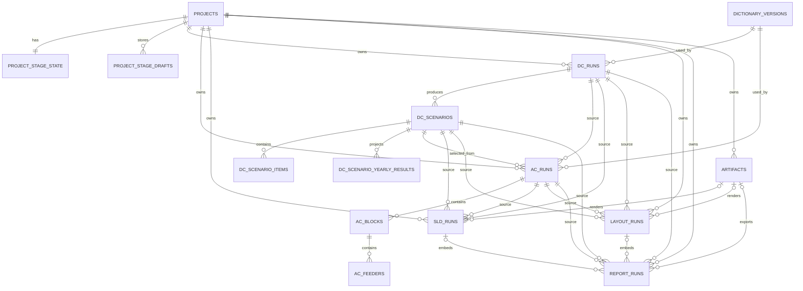
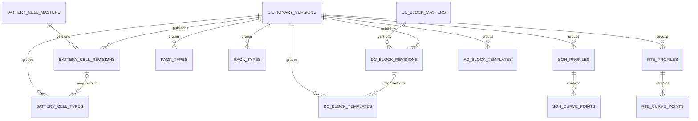

# CALB Sizing Tool Database Design and ER

## 1. 目标和范围

这份设计文档的目标不是一次性把系统重写成“完美架构”，而是先解决当前无数据库版本的 4 个核心问题：

1. 页面刷新或会话失效后，输入和中间结果容易丢失。
2. `DC -> AC -> SLD/Layout -> Report` 之间靠 `session_state` 和临时 dict 串联，缺少稳定主键和上下游追踪。
3. 同一项目不能稳定保存多次运行、多方案结果和图纸版本。
4. 图纸、报告和计算结果之间缺少可审计的引用关系。

本设计按 `PostgreSQL` 作为首选数据库来设计，原因是：

- 支持 `JSONB`
- 支持强约束和外键
- 适合“结构化字段 + 原始 payload 并存”的迁移方式

如果后续要落到 MySQL，也可以平移，但 `JSONB`、部分索引、约束能力会差一些。

## 2. 设计原则

### 2.1 项目、草稿、运行分开

- `Project` 是长期对象。
- `Draft` 是用户还在编辑、还没点击运行的输入快照。
- `Run` 是一次正式计算或正式生成动作的不可变结果。

### 2.2 所有运行结果都要可追溯

每一条下游记录都必须明确指向上游来源：

- `AC Run` 必须指向 `DC Run + DC Scenario`
- `SLD/Layout/Report Run` 必须指向 `DC Scenario + AC Run`

### 2.3 结果表保留关键字段，同时保留原始 JSON

每个运行表建议同时保存两类信息：

- 关键业务字段
  - 用于列表、筛选、约束、统计
- `input_json / output_json / meta_json`
  - 用于兼容当前代码中的动态字段
  - 用于降低首期改造成本

### 2.4 图纸和报告不直接存大字段二进制

建议：

- 图纸 SVG/PNG
- 报告 DOCX
- 快照 JSON

统一先写 `artifacts` 元数据表，实际内容落文件系统或对象存储。

### 2.5 主数据要版本化

当前 Excel 字典是计算来源，数据库版必须保留版本概念，否则无法复现历史结果。

## 3. 从当前对象到数据库对象的映射

| 当前对象 | 当前来源 | 建议数据库归属 |
|---|---|---|
| `dc_inputs.*` | `st.session_state` | `project_stage_drafts(stage_code='dc')` |
| `stage13_output` | DC 页面打包 DTO | `dc_runs + dc_scenarios + dc_scenario_yearly_results` |
| `dc_result_summary` | DC 页面轻量摘要 | `project_stage_state.active_dc_*` 或 `dc_scenarios` 摘要字段 |
| `ac_output` | AC 页面输出 | `ac_runs + ac_blocks + ac_feeders` |
| `diagram_inputs` | SLD 页面输入 | `project_stage_drafts(stage_code='sld')` |
| `layout_inputs` | Layout 页面输入 | `project_stage_drafts(stage_code='layout')` |
| `diagram_results` | SLD 渲染结果 | `sld_runs + artifacts` |
| `layout_results` | Layout 渲染结果 | `layout_runs + artifacts` |
| `report_context` | Report 动态拼装 | `report_runs.context_json` |
| `artifacts["*bytes"]` | Session 临时二进制 | `artifacts` |
| `outputs/sld_latest.*` | 文件覆盖 | `artifacts` 的具体存储文件 |

## 4. 表设计总览

建议把表分成 6 组：

1. 项目和工作态
2. 字典版本和主数据
3. DC 运行结果
4. AC 运行结果
5. 图纸和报告运行结果
6. 文件工件

## 5. 通用字段约定

除特殊说明外，业务表默认建议带这些字段：

| 字段 | 类型 | 说明 |
|---|---|---|
| `id` | `uuid` | 主键，若表有明确业务主键名则不用该列 |
| `created_at` | `timestamptz` | 创建时间 |
| `updated_at` | `timestamptz` | 更新时间 |
| `created_by` | `varchar(64)` | 预留，当前可空 |
| `updated_by` | `varchar(64)` | 预留，当前可空 |
| `status` | `varchar(24)` | `draft/running/succeeded/failed/archived` |

数值字段建议：

- 功率/容量/电压/效率：`numeric(16,6)`
- 计数：`integer`
- 原始 payload：`jsonb`

## 6. 项目和工作态表

### 6.1 `projects`

项目主表。

| 字段 | 类型 | 约束 | 说明 |
|---|---|---|---|
| `project_id` | `uuid` | PK | 项目标识 |
| `project_code` | `varchar(64)` | UNIQUE | 可读编码，便于列表检索 |
| `project_name` | `varchar(255)` | NOT NULL | 项目名称 |
| `project_status` | `varchar(24)` | NOT NULL | `active/archived` |
| `description` | `text` | NULL | 备注 |
| `created_at` | `timestamptz` | NOT NULL | 创建时间 |
| `updated_at` | `timestamptz` | NOT NULL | 更新时间 |

### 6.2 `project_stage_state`

这个表用来替代当前 session 里的“当前激活结果引用”。

一条项目记录只保留一条当前工作态。

| 字段 | 类型 | 约束 | 说明 |
|---|---|---|---|
| `project_id` | `uuid` | PK, FK -> `projects.project_id` | 项目 |
| `active_dc_run_id` | `uuid` | FK -> `dc_runs.dc_run_id` | 当前 DC 运行 |
| `active_dc_scenario_id` | `uuid` | FK -> `dc_scenarios.dc_scenario_id` | 当前选中的 DC 方案 |
| `active_ac_run_id` | `uuid` | FK -> `ac_runs.ac_run_id` | 当前 AC 运行 |
| `active_sld_run_id` | `uuid` | FK -> `sld_runs.sld_run_id` | 当前 SLD |
| `active_layout_run_id` | `uuid` | FK -> `layout_runs.layout_run_id` | 当前 Layout |
| `active_report_run_id` | `uuid` | FK -> `report_runs.report_run_id` | 当前 Report |
| `updated_at` | `timestamptz` | NOT NULL | 最近更新时间 |

### 6.3 `project_stage_drafts`

这个表用来解决“页面输入容易丢失”的问题。

每个项目每个 stage 保留 1 份最新草稿。

| 字段 | 类型 | 约束 | 说明 |
|---|---|---|---|
| `draft_id` | `uuid` | PK | 草稿主键 |
| `project_id` | `uuid` | FK -> `projects.project_id` | 项目 |
| `stage_code` | `varchar(24)` | NOT NULL | `dc/ac/sld/layout/report` |
| `draft_json` | `jsonb` | NOT NULL | 当前页面输入草稿 |
| `ui_version` | `varchar(32)` | NULL | 前端/页面版本 |
| `updated_at` | `timestamptz` | NOT NULL | 最近保存时间 |

建议唯一约束：

- `UNIQUE(project_id, stage_code)`

## 7. 字典版本和主数据表

## 7.1 `dictionary_versions`

统一记录 Excel 字典导入版本。

| 字段 | 类型 | 约束 | 说明 |
|---|---|---|---|
| `dictionary_version_id` | `uuid` | PK | 字典版本主键 |
| `domain_code` | `varchar(16)` | NOT NULL | `dc/ac` |
| `version_label` | `varchar(64)` | NOT NULL | 业务版本号 |
| `source_file_name` | `varchar(255)` | NOT NULL | 原始文件名 |
| `source_file_sha256` | `varchar(64)` | NOT NULL | 文件 hash |
| `is_active` | `boolean` | NOT NULL | 当前是否启用 |
| `loaded_at` | `timestamptz` | NOT NULL | 导入时间 |
| `meta_json` | `jsonb` | NULL | 额外信息 |

建议唯一约束：

- `UNIQUE(domain_code, source_file_sha256)`

## 7.2 DC 主数据表

### 7.2.1 `battery_cell_types`

| 字段 | 类型 | 约束 | 说明 |
|---|---|---|---|
| `cell_type_id` | `uuid` | PK | 主键 |
| `dictionary_version_id` | `uuid` | FK -> `dictionary_versions` | 字典版本 |
| `source_cell_type_id` | `integer` | NOT NULL | Excel 原始 ID |
| `cell_model` | `varchar(128)` | NULL | 型号 |
| `cell_capacity_ah` | `numeric(16,6)` | NULL | 容量 |
| `cell_nominal_voltage_v` | `numeric(16,6)` | NULL | 标称电压 |
| `cell_energy_wh` | `numeric(16,6)` | NULL | 单体能量 |
| `raw_row_json` | `jsonb` | NOT NULL | 原始行 |

### 7.2.2 `pack_types`

| 字段 | 类型 | 约束 | 说明 |
|---|---|---|---|
| `pack_type_id` | `uuid` | PK | 主键 |
| `dictionary_version_id` | `uuid` | FK -> `dictionary_versions` | 字典版本 |
| `source_pack_type_id` | `integer` | NOT NULL | Excel 原始 ID |
| `source_cell_type_id` | `integer` | NOT NULL | Excel 关联 Cell ID |
| `cells_in_series` | `integer` | NULL | 串数 |
| `cells_in_parallel` | `integer` | NULL | 并数 |
| `pack_nominal_voltage_v` | `numeric(16,6)` | NULL | Pack 电压 |
| `raw_row_json` | `jsonb` | NOT NULL | 原始行 |

### 7.2.3 `rack_types`

| 字段 | 类型 | 约束 | 说明 |
|---|---|---|---|
| `rack_type_id` | `uuid` | PK | 主键 |
| `dictionary_version_id` | `uuid` | FK -> `dictionary_versions` | 字典版本 |
| `source_rack_type_id` | `integer` | NOT NULL | Excel 原始 ID |
| `source_pack_type_id` | `integer` | NOT NULL | Excel 关联 Pack ID |
| `packs_per_rack` | `integer` | NULL | 每 rack pack 数 |
| `raw_row_json` | `jsonb` | NOT NULL | 原始行 |

### 7.2.4 `dc_block_templates`

| 字段 | 类型 | 约束 | 说明 |
|---|---|---|---|
| `dc_block_template_id` | `uuid` | PK | 主键 |
| `dictionary_version_id` | `uuid` | FK -> `dictionary_versions` | 字典版本 |
| `source_dc_block_code` | `varchar(128)` | NOT NULL | Excel block code |
| `source_dc_block_name` | `varchar(255)` | NOT NULL | Excel block name |
| `block_form` | `varchar(24)` | NOT NULL | `container/cabinet` |
| `source_rack_type_id` | `integer` | NULL | 关联 rack |
| `racks_per_block` | `integer` | NULL | 每 block rack 数 |
| `block_nameplate_capacity_mwh` | `numeric(16,6)` | NULL | 标称容量 |
| `is_active` | `boolean` | NOT NULL | 是否启用 |
| `is_default_option` | `boolean` | NOT NULL | 是否默认 |
| `raw_row_json` | `jsonb` | NOT NULL | 原始行 |

### 7.2.5 `soh_profiles`

| 字段 | 类型 | 约束 | 说明 |
|---|---|---|---|
| `soh_profile_id` | `uuid` | PK | 主键 |
| `dictionary_version_id` | `uuid` | FK -> `dictionary_versions` | 字典版本 |
| `source_profile_id` | `integer` | NOT NULL | Excel 原始 ID |
| `c_rate` | `numeric(16,6)` | NOT NULL | C Rate |
| `cycles_per_year` | `integer` | NOT NULL | 年循环次数 |
| `raw_row_json` | `jsonb` | NOT NULL | 原始行 |

### 7.2.6 `soh_curve_points`

| 字段 | 类型 | 约束 | 说明 |
|---|---|---|---|
| `soh_curve_point_id` | `uuid` | PK | 主键 |
| `soh_profile_id` | `uuid` | FK -> `soh_profiles.soh_profile_id` | 所属 profile |
| `life_year_index` | `integer` | NOT NULL | 生命周期年序号 |
| `soh_dc_pct` | `numeric(16,6)` | NOT NULL | SOH 值 |
| `raw_row_json` | `jsonb` | NOT NULL | 原始行 |

建议唯一约束：

- `UNIQUE(soh_profile_id, life_year_index)`

### 7.2.7 `rte_profiles`

| 字段 | 类型 | 约束 | 说明 |
|---|---|---|---|
| `rte_profile_id` | `uuid` | PK | 主键 |
| `dictionary_version_id` | `uuid` | FK -> `dictionary_versions` | 字典版本 |
| `source_profile_id` | `integer` | NOT NULL | Excel 原始 ID |
| `c_rate` | `numeric(16,6)` | NOT NULL | C Rate |
| `raw_row_json` | `jsonb` | NOT NULL | 原始行 |

### 7.2.8 `rte_curve_points`

| 字段 | 类型 | 约束 | 说明 |
|---|---|---|---|
| `rte_curve_point_id` | `uuid` | PK | 主键 |
| `rte_profile_id` | `uuid` | FK -> `rte_profiles.rte_profile_id` | 所属 profile |
| `soh_band_min_pct` | `numeric(16,6)` | NOT NULL | SOH band 下限 |
| `rte_dc_pct` | `numeric(16,6)` | NOT NULL | DC RTE |
| `raw_row_json` | `jsonb` | NOT NULL | 原始行 |

建议唯一约束：

- `UNIQUE(rte_profile_id, soh_band_min_pct)`

## 7.3 AC 主数据表

### `ac_block_templates`

当前 AC 页面有很多固定枚举，后续建议逐步收敛到数据库模板。

| 字段 | 类型 | 约束 | 说明 |
|---|---|---|---|
| `ac_block_template_id` | `uuid` | PK | 主键 |
| `dictionary_version_id` | `uuid` | FK -> `dictionary_versions` | 字典版本 |
| `template_code` | `varchar(128)` | NOT NULL | 模板编码 |
| `pcs_per_block` | `integer` | NOT NULL | 每 block PCS 数 |
| `pcs_rating_kw` | `numeric(16,6)` | NOT NULL | 单 PCS 功率 |
| `feeders_per_block` | `integer` | NOT NULL | feeder 数 |
| `transformer_rating_kva` | `numeric(16,6)` | NULL | 变压器容量 |
| `mv_voltage_kv` | `numeric(16,6)` | NULL | MV 电压 |
| `lv_voltage_v` | `numeric(16,6)` | NULL | LV 电压 |
| `grid_power_factor` | `numeric(16,6)` | NULL | PF |
| `is_active` | `boolean` | NOT NULL | 是否启用 |
| `raw_row_json` | `jsonb` | NOT NULL | 原始行 |

## 8. DC 运行结果表

### 8.1 `dc_runs`

一条 `dc_runs` 代表用户点击一次 `Run Sizing`。

| 字段 | 类型 | 约束 | 说明 |
|---|---|---|---|
| `dc_run_id` | `uuid` | PK | DC 运行 ID |
| `project_id` | `uuid` | FK -> `projects.project_id` | 所属项目 |
| `dc_dictionary_version_id` | `uuid` | FK -> `dictionary_versions.dictionary_version_id` | 使用的 DC 字典版本 |
| `project_name_snapshot` | `varchar(255)` | NOT NULL | 运行时项目名快照 |
| `input_json` | `jsonb` | NOT NULL | 原始输入 |
| `stage1_json` | `jsonb` | NOT NULL | Stage1 全量输出 |
| `poi_power_req_mw` | `numeric(16,6)` | NOT NULL | POI 功率 |
| `poi_energy_req_mwh` | `numeric(16,6)` | NOT NULL | POI 容量 |
| `poi_nominal_voltage_kv` | `numeric(16,6)` | NULL | MV 电压 |
| `poi_frequency_hz` | `numeric(16,6)` | NULL | 频率 |
| `project_life_years` | `integer` | NOT NULL | 生命周期 |
| `cycles_per_year` | `integer` | NOT NULL | 年循环次数 |
| `poi_guarantee_year` | `integer` | NOT NULL | 保证年 |
| `eff_dc_to_poi_frac` | `numeric(16,6)` | NOT NULL | 一次效率链 |
| `dc_energy_capacity_required_mwh` | `numeric(16,6)` | NOT NULL | 理论所需 DC 容量 |
| `dc_power_required_mw` | `numeric(16,6)` | NOT NULL | 理论所需 DC 功率 |
| `status` | `varchar(24)` | NOT NULL | 运行状态 |
| `error_message` | `text` | NULL | 失败原因 |
| `created_at` | `timestamptz` | NOT NULL | 运行时间 |

### 8.2 `dc_scenarios`

一条 `dc_runs` 可以产出多个 scenario。

| 字段 | 类型 | 约束 | 说明 |
|---|---|---|---|
| `dc_scenario_id` | `uuid` | PK | 场景 ID |
| `dc_run_id` | `uuid` | FK -> `dc_runs.dc_run_id` | 所属 DC 运行 |
| `scenario_code` | `varchar(32)` | NOT NULL | `container_only/hybrid/cabinet_only` |
| `display_order` | `integer` | NOT NULL | 页面展示顺序 |
| `is_active_selected` | `boolean` | NOT NULL | 是否当前选中 |
| `converged` | `boolean` | NOT NULL | 是否满足保证年目标 |
| `iteration_count` | `integer` | NOT NULL | 迭代次数 |
| `container_count` | `integer` | NOT NULL | container 数量 |
| `cabinet_count` | `integer` | NOT NULL | cabinet 数量 |
| `busbars_needed` | `integer` | NOT NULL | 母排组数 |
| `dc_nameplate_bol_mwh` | `numeric(16,6)` | NOT NULL | BOL DC 容量 |
| `oversize_mwh` | `numeric(16,6)` | NOT NULL | 超配容量 |
| `config_adjustment_frac` | `numeric(16,6)` | NOT NULL | 配置调整比 |
| `poi_usable_energy_mwh_at_guarantee_year` | `numeric(16,6)` | NULL | 保证年可用能量 |
| `stage2_json` | `jsonb` | NOT NULL | Stage2 原始结果 |
| `stage3_meta_json` | `jsonb` | NOT NULL | Stage3 元信息 |

建议唯一约束：

- `UNIQUE(dc_run_id, scenario_code)`

### 8.3 `dc_scenario_items`

对应当前 `block_config_table`。

| 字段 | 类型 | 约束 | 说明 |
|---|---|---|---|
| `dc_scenario_item_id` | `uuid` | PK | 主键 |
| `dc_scenario_id` | `uuid` | FK -> `dc_scenarios.dc_scenario_id` | 所属场景 |
| `line_no` | `integer` | NOT NULL | 行号 |
| `block_code` | `varchar(128)` | NOT NULL | block code |
| `block_name` | `varchar(255)` | NOT NULL | block name |
| `block_form` | `varchar(24)` | NOT NULL | `container/cabinet` |
| `unit_capacity_mwh` | `numeric(16,6)` | NOT NULL | 单机容量 |
| `quantity` | `integer` | NOT NULL | 数量 |
| `subtotal_mwh` | `numeric(16,6)` | NOT NULL | 小计 |

建议唯一约束：

- `UNIQUE(dc_scenario_id, line_no)`

### 8.4 `dc_scenario_yearly_results`

对应当前 Stage3 的逐年结果 DataFrame。

| 字段 | 类型 | 约束 | 说明 |
|---|---|---|---|
| `dc_year_result_id` | `uuid` | PK | 主键 |
| `dc_scenario_id` | `uuid` | FK -> `dc_scenarios.dc_scenario_id` | 所属场景 |
| `year_index` | `integer` | NOT NULL | 年序号 |
| `soh_relative` | `numeric(16,6)` | NOT NULL | 相对 SOH |
| `soh_absolute` | `numeric(16,6)` | NOT NULL | 绝对 SOH |
| `dc_nameplate_bol_mwh` | `numeric(16,6)` | NOT NULL | BOL 容量 |
| `dc_gross_capacity_mwh` | `numeric(16,6)` | NOT NULL | Gross capacity |
| `dc_usable_mwh` | `numeric(16,6)` | NOT NULL | DC usable |
| `dc_rte_frac` | `numeric(16,6)` | NOT NULL | DC RTE |
| `system_rte_frac` | `numeric(16,6)` | NOT NULL | 系统 RTE |
| `poi_usable_energy_mwh` | `numeric(16,6)` | NOT NULL | POI 可用能量 |
| `meets_poi_req` | `boolean` | NOT NULL | 是否满足目标 |
| `is_guarantee_year` | `boolean` | NOT NULL | 是否保证年 |

建议唯一约束：

- `UNIQUE(dc_scenario_id, year_index)`

## 9. AC 运行结果表

### 9.1 `ac_runs`

一条 `ac_runs` 代表用户在某个 DC scenario 基础上确认一次 AC 配置。

| 字段 | 类型 | 约束 | 说明 |
|---|---|---|---|
| `ac_run_id` | `uuid` | PK | AC 运行 ID |
| `project_id` | `uuid` | FK -> `projects.project_id` | 所属项目 |
| `source_dc_run_id` | `uuid` | FK -> `dc_runs.dc_run_id` | 来源 DC 运行 |
| `source_dc_scenario_id` | `uuid` | FK -> `dc_scenarios.dc_scenario_id` | 来源 DC 场景 |
| `ac_dictionary_version_id` | `uuid` | FK -> `dictionary_versions.dictionary_version_id` | 使用的 AC 字典版本 |
| `selected_ratio` | `varchar(16)` | NOT NULL | `1:1/1:2/1:4/1:8` |
| `input_json` | `jsonb` | NOT NULL | 页面原始输入 |
| `options_json` | `jsonb` | NULL | 当次生成的所有 ratio/PCS 选项 |
| `output_json` | `jsonb` | NOT NULL | 全量 AC 输出 |
| `num_blocks` | `integer` | NOT NULL | AC Block 数量 |
| `pcs_per_block` | `integer` | NOT NULL | 每 block PCS 数 |
| `pcs_rating_kw` | `numeric(16,6)` | NOT NULL | 单 PCS 功率 |
| `pcs_count_total` | `integer` | NOT NULL | 总 PCS 数 |
| `block_size_mw` | `numeric(16,6)` | NOT NULL | 单 block 功率 |
| `total_ac_mw` | `numeric(16,6)` | NOT NULL | 总 AC 功率 |
| `overhead_mw` | `numeric(16,6)` | NOT NULL | 超配功率 |
| `dc_blocks_total` | `integer` | NOT NULL | 总 DC Block 数 |
| `dc_total_mwh` | `numeric(16,6)` | NOT NULL | 总 DC 容量 |
| `mv_voltage_kv` | `numeric(16,6)` | NULL | MV 电压 |
| `lv_voltage_v` | `numeric(16,6)` | NULL | LV 电压 |
| `transformer_count` | `integer` | NOT NULL | 变压器数量 |
| `status` | `varchar(24)` | NOT NULL | 运行状态 |
| `error_message` | `text` | NULL | 失败原因 |
| `created_at` | `timestamptz` | NOT NULL | 创建时间 |

### 9.2 `ac_blocks`

对应 `dc_allocation_plan` 中每个 AC block 的聚合信息。

| 字段 | 类型 | 约束 | 说明 |
|---|---|---|---|
| `ac_block_id` | `uuid` | PK | 主键 |
| `ac_run_id` | `uuid` | FK -> `ac_runs.ac_run_id` | 所属 AC 运行 |
| `block_index` | `integer` | NOT NULL | block 序号，从 1 开始 |
| `dc_blocks_total` | `integer` | NOT NULL | 该 block 承载的 DC block 数 |
| `pcs_count` | `integer` | NOT NULL | 该 block PCS 数 |
| `block_size_mw` | `numeric(16,6)` | NOT NULL | 该 block 功率 |
| `container_size_ft` | `integer` | NULL | `20/40` |
| `transformer_rating_kva` | `numeric(16,6)` | NULL | 该 block 变压器容量 |

建议唯一约束：

- `UNIQUE(ac_run_id, block_index)`

### 9.3 `ac_feeders`

对应每个 AC block 下的 feeder 级分配结果。

| 字段 | 类型 | 约束 | 说明 |
|---|---|---|---|
| `ac_feeder_id` | `uuid` | PK | 主键 |
| `ac_block_id` | `uuid` | FK -> `ac_blocks.ac_block_id` | 所属 block |
| `feeder_index` | `integer` | NOT NULL | feeder 序号 |
| `pcs_id_label` | `varchar(64)` | NULL | 如 `PCS-01` |
| `dc_block_count` | `integer` | NOT NULL | feeder 上挂接的 DC block 数 |
| `pcs_rating_kw` | `numeric(16,6)` | NULL | feeder 对应 PCS 功率 |

建议唯一约束：

- `UNIQUE(ac_block_id, feeder_index)`

## 10. 文件工件表

### `artifacts`

统一记录 SVG、PNG、DOCX、JSON 快照等文件元数据。

| 字段 | 类型 | 约束 | 说明 |
|---|---|---|---|
| `artifact_id` | `uuid` | PK | 工件 ID |
| `project_id` | `uuid` | FK -> `projects.project_id` | 所属项目 |
| `artifact_role` | `varchar(32)` | NOT NULL | `sld_svg/sld_png/layout_svg/layout_png/report_docx/snapshot_json/spec_json` |
| `file_name` | `varchar(255)` | NOT NULL | 文件名 |
| `mime_type` | `varchar(128)` | NOT NULL | MIME |
| `storage_backend` | `varchar(32)` | NOT NULL | `local/s3/minio/...` |
| `storage_path` | `text` | NOT NULL | 物理路径或 URI |
| `sha256` | `varchar(64)` | NOT NULL | 内容 hash |
| `size_bytes` | `bigint` | NOT NULL | 文件大小 |
| `created_at` | `timestamptz` | NOT NULL | 创建时间 |

建议唯一约束：

- `UNIQUE(sha256)`

## 11. SLD / Layout / Report 运行结果表

### 11.1 `sld_runs`

| 字段 | 类型 | 约束 | 说明 |
|---|---|---|---|
| `sld_run_id` | `uuid` | PK | SLD 运行 ID |
| `project_id` | `uuid` | FK -> `projects.project_id` | 所属项目 |
| `source_dc_run_id` | `uuid` | FK -> `dc_runs.dc_run_id` | 来源 DC run |
| `source_dc_scenario_id` | `uuid` | FK -> `dc_scenarios.dc_scenario_id` | 来源 DC scenario |
| `source_ac_run_id` | `uuid` | FK -> `ac_runs.ac_run_id` | 来源 AC run |
| `group_index` | `integer` | NOT NULL | AC Block Group 序号 |
| `scenario_code` | `varchar(32)` | NOT NULL | 当前场景码 |
| `input_json` | `jsonb` | NOT NULL | 页面输入 |
| `snapshot_json` | `jsonb` | NOT NULL | SLD 快照 |
| `spec_json` | `jsonb` | NOT NULL | 渲染 spec |
| `meta_json` | `jsonb` | NOT NULL | 生成元信息 |
| `snapshot_hash` | `varchar(64)` | NOT NULL | 快照 hash |
| `svg_artifact_id` | `uuid` | FK -> `artifacts.artifact_id` | SVG 文件 |
| `png_artifact_id` | `uuid` | FK -> `artifacts.artifact_id` | PNG 文件 |
| `snapshot_artifact_id` | `uuid` | FK -> `artifacts.artifact_id` | 快照 JSON 文件 |
| `status` | `varchar(24)` | NOT NULL | 运行状态 |
| `created_at` | `timestamptz` | NOT NULL | 创建时间 |

### 11.2 `layout_runs`

| 字段 | 类型 | 约束 | 说明 |
|---|---|---|---|
| `layout_run_id` | `uuid` | PK | Layout 运行 ID |
| `project_id` | `uuid` | FK -> `projects.project_id` | 所属项目 |
| `source_dc_run_id` | `uuid` | FK -> `dc_runs.dc_run_id` | 来源 DC run |
| `source_dc_scenario_id` | `uuid` | FK -> `dc_scenarios.dc_scenario_id` | 来源 DC scenario |
| `source_ac_run_id` | `uuid` | FK -> `ac_runs.ac_run_id` | 来源 AC run |
| `block_index` | `integer` | NOT NULL | AC Block 序号 |
| `arrangement_code` | `varchar(24)` | NOT NULL | `auto/1x4/2x2/4x1/4x2/4x4` |
| `input_json` | `jsonb` | NOT NULL | 页面输入 |
| `spec_json` | `jsonb` | NOT NULL | 布局 spec |
| `meta_json` | `jsonb` | NOT NULL | 生成元信息 |
| `svg_artifact_id` | `uuid` | FK -> `artifacts.artifact_id` | SVG 文件 |
| `png_artifact_id` | `uuid` | FK -> `artifacts.artifact_id` | PNG 文件 |
| `spec_artifact_id` | `uuid` | FK -> `artifacts.artifact_id` | spec JSON 文件 |
| `status` | `varchar(24)` | NOT NULL | 运行状态 |
| `created_at` | `timestamptz` | NOT NULL | 创建时间 |

### 11.3 `report_runs`

| 字段 | 类型 | 约束 | 说明 |
|---|---|---|---|
| `report_run_id` | `uuid` | PK | 报告运行 ID |
| `project_id` | `uuid` | FK -> `projects.project_id` | 所属项目 |
| `source_dc_run_id` | `uuid` | FK -> `dc_runs.dc_run_id` | 来源 DC run |
| `source_dc_scenario_id` | `uuid` | FK -> `dc_scenarios.dc_scenario_id` | 来源 DC scenario |
| `source_ac_run_id` | `uuid` | FK -> `ac_runs.ac_run_id` | 来源 AC run |
| `source_sld_run_id` | `uuid` | FK -> `sld_runs.sld_run_id` | 引用的 SLD，可空 |
| `source_layout_run_id` | `uuid` | FK -> `layout_runs.layout_run_id` | 引用的 Layout，可空 |
| `report_template_code` | `varchar(32)` | NOT NULL | `v2_1/v2_1_guoxia/...` |
| `brand_code` | `varchar(32)` | NULL | 品牌/抬头 |
| `context_json` | `jsonb` | NOT NULL | ReportContext 序列化结果 |
| `qc_json` | `jsonb` | NULL | QC 结果 |
| `docx_artifact_id` | `uuid` | FK -> `artifacts.artifact_id` | DOCX 文件 |
| `status` | `varchar(24)` | NOT NULL | 运行状态 |
| `created_at` | `timestamptz` | NOT NULL | 创建时间 |

## 12. 推荐索引和约束

### 12.1 唯一约束

- `projects.project_code`
- `project_stage_drafts(project_id, stage_code)`
- `dc_scenarios(dc_run_id, scenario_code)`
- `dc_scenario_items(dc_scenario_id, line_no)`
- `dc_scenario_yearly_results(dc_scenario_id, year_index)`
- `ac_blocks(ac_run_id, block_index)`
- `ac_feeders(ac_block_id, feeder_index)`
- `artifacts.sha256`

### 12.2 常用索引

- `dc_runs(project_id, created_at desc)`
- `dc_scenarios(dc_run_id, is_active_selected)`
- `ac_runs(project_id, created_at desc)`
- `sld_runs(project_id, created_at desc)`
- `layout_runs(project_id, created_at desc)`
- `report_runs(project_id, created_at desc)`
- `dc_scenario_yearly_results(dc_scenario_id, year_index)`

### 12.3 JSON 索引建议

只有在确认查询场景稳定后再加 `GIN`：

- `project_stage_drafts.draft_json`
- `dc_runs.input_json`
- `ac_runs.options_json`
- `report_runs.context_json`

首期不建议一开始就大量上 JSON 索引。

## 13. 运行态 ER 图

## 14. 字典主数据 ER 图

## 14A. 可维护主数据补充

为后续“电芯基础参数维护”和“DC Block 基础参数维护”界面预留，数据库里增加两组可维护表：

- `battery_cell_masters`
- `battery_cell_revisions`
- `dc_block_masters`
- `dc_block_revisions`

这四张表和原来的 `dictionary_versions` / `battery_cell_types` / `dc_block_templates` 不是替代关系，而是上下游关系：

- `masters`
  - 代表稳定的业务对象主键，适合页面列表、启停用、权限控制
- `revisions`
  - 代表每次编辑后的参数版本，适合草稿、发布、回滚
- `dictionary_versions + snapshot tables`
  - 代表给计算引擎消费的不可变发布快照

推荐发布链路：

1. 在 `battery_cell_revisions` 或 `dc_block_revisions` 中维护草稿参数
2. 审核通过后创建新的 `dictionary_version`
3. 把发布 revision 映射成新的 `battery_cell_types` / `dc_block_templates`
4. DC 计算只读取发布快照，不直接读取 revision

这样后面做维护后台时，既能支持参数持续修改，也不会破坏历史项目复算。

## 15. 推荐运行流程

数据库版建议按下面的动作链来落：

### 15.1 用户输入阶段

用户在页面输入时：

- 把当前表单随时保存到 `project_stage_drafts`
- 页面重新打开时直接回填草稿

### 15.2 DC 运行阶段

点击 `Run DC` 时：

1. 新建 `dc_runs`
2. 为每个模式写 `dc_scenarios`
3. 写 `dc_scenario_items`
4. 写 `dc_scenario_yearly_results`
5. 更新 `project_stage_state.active_dc_run_id`
6. 更新 `project_stage_state.active_dc_scenario_id`

### 15.3 AC 运行阶段

点击 `Run AC` 时：

1. 新建 `ac_runs`
2. 写 `ac_blocks`
3. 写 `ac_feeders`
4. 更新 `project_stage_state.active_ac_run_id`

### 15.4 SLD / Layout / Report 阶段

每次生成都新建一条 run，不覆盖历史版本：

- `sld_runs`
- `layout_runs`
- `report_runs`

同时写 `artifacts`，并把当前激活版本写回 `project_stage_state`。

## 16. 实施建议

### 16.1 第一阶段

先实现最小闭环：

- `projects`
- `project_stage_state`
- `project_stage_drafts`
- `dc_runs`
- `dc_scenarios`
- `dc_scenario_items`
- `dc_scenario_yearly_results`
- `ac_runs`
- `ac_blocks`
- `ac_feeders`

这样先把“输入不丢 + 计算可追溯”解决掉。

### 16.2 第二阶段

再补：

- `artifacts`
- `sld_runs`
- `layout_runs`
- `report_runs`

这样图纸和报告就能版本化。

### 16.3 第三阶段

最后再把 Excel 主数据导入数据库：

- `dictionary_versions`
- 各类模板/曲线表

这样才能做到“历史结果可复算”。

## 17. 这版设计的核心判断

数据库版不应该简单把当前 `session_state` 原样搬进库里，而应该建立三层结构：

1. `Draft`
   - 解决输入易丢失
2. `Run`
   - 解决结果可追溯
3. `State Pointer`
   - 解决项目当前工作态恢复

如果按这个思路实现，后续这几个问题会一起被解决：

- 页面刷新后数据不丢
- 多方案可以长期保存
- AC/SLD/Layout/Report 都有稳定来源
- 报告能追溯到明确图纸版本
- 同一项目可以保存多次迭代历史

## 18. 下一步建议

如果这份表设计方向认可，下一步最合适的是继续做两件事之一：

1. 输出一版 PostgreSQL DDL 初稿。
2. 先把当前代码中的 `DC/AC/SLD/Report` DTO 统一成数据库可落表的 schema。
